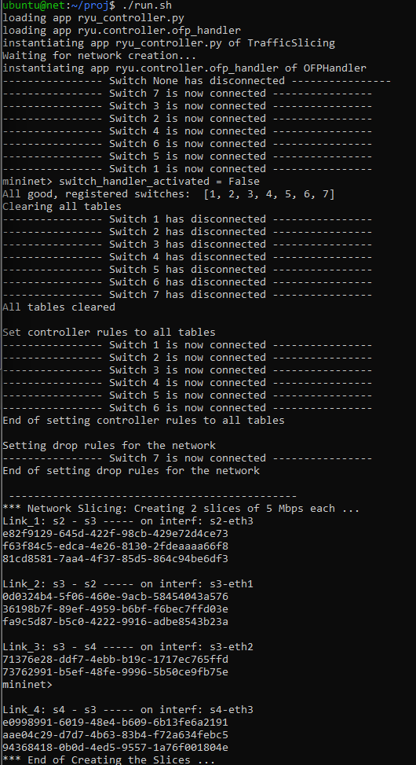
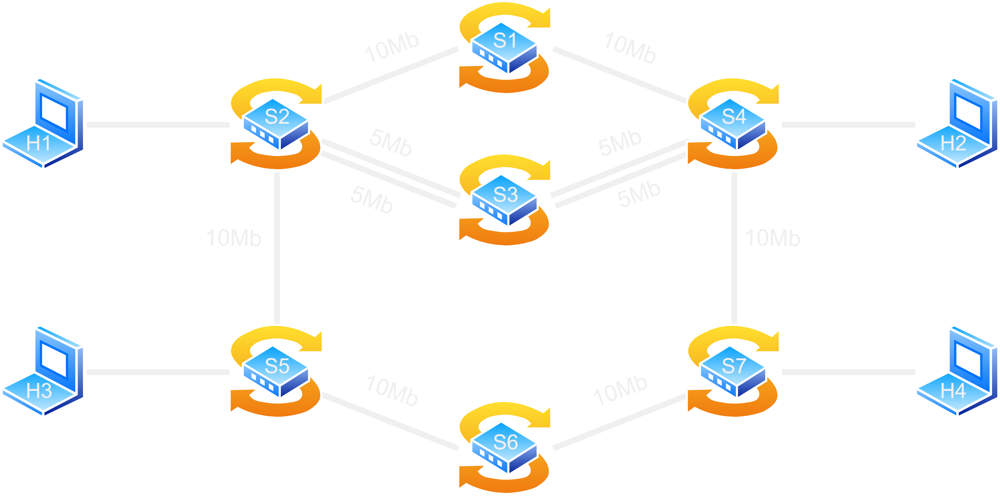

Italian version [here](README-it.md)

---

# Resilient Network Controller

> The Resilient Network Controller project is designed to ensure that network operations remain smooth and uninterrupted, even in the face of switch failures. By dynamically reorganizing the network and providing real-time monitoring and automated responses, this solution enhances the reliability and performance of modern networks, making them more resilient and efficient.

## Contents
- [Key Features](#key-features)
- [Benefits](#benefits)
- [Use Cases](#use-cases)
- [Getting Started](#getting-started)
- [Graphical Representation](#graphical-representation)
- [Testing](#testing)

---

### Key Features

- **Dynamic Network Reorganization**:
    - The controller continuously monitors the status of all switches within the network.
    - Upon detecting a switch failure, the controller immediately identifies alternative paths and reconfigures the network to bypass the faulty switch.
    - This reorganization minimizes downtime and ensures that network services remain uninterrupted.

- **Automated Response**:
    - Implements automated response mechanisms to handle switch failures without manual intervention.
    - Ensures rapid recovery and reduces the risk of prolonged network outages.

### Benefits

- **Increased Network Uptime**: Reduces the impact of switch failures, ensuring that network services remain available.
- **Improved Reliability**: Enhances the overall reliability of the network by providing redundant paths and failover mechanisms.
- **Cost-Effective**: Reduces the need for manual network management and troubleshooting, lowering operational costs.
- **Enhanced Performance**: Maintains optimal network performance by dynamically adjusting to changes in the network topology.

### Use Cases

- **Enterprise Networks**: Ensures business continuity by maintaining network services in corporate environments.
- **Data Centers**: Enhances the reliability of data center networks, preventing disruptions in critical applications and services.
- **Campus Networks**: Provides robust connectivity for educational institutions, supporting uninterrupted access to online resources and services.


## Getting Started

Initialization Commands
To start the network and the controller, simply execute the script:

```bash
./run.sh
```

<details>
<summary>output</summary>
    <p align="center">
      
    </p>
</details>

This script will
- handle setting the necessary permissions for the various scripts
- converting .sh files to Unix format
- starting the controller in the background
- creating the network.

## Network Description
there are 4 hosts (h) paired as follows
- h1 with h2
- h3 with h4

there are 7 switches (s) that create 3 channels
1.  h1 and h2 have a dedicated channel for UDP messages on port 9999 (connection s2 - s1 - s4)
2.  h3 and h4 have a dedicated channel for UDP messages on port 9997 (connection s5 - s6 - s7)
3.  dual channel on s2 - s3 - s4 --> 5Mbps per channel. All TCP, ICMP, and UDP messages with unspecified ports pass through here

## Graphical Representation

```
                   |---10Mbps--- s1 ---10Mbps---|
                   |                            |
h1 ----10Mbps---- s2                            s4 ----10Mbps---- h2
                 |  |                          |  |
                 |  |---5Mbps--- s3 ---5Mbps---|  |
                 |                                |
                 |                                |
h3 ---10Mbps--- s5                                s7 ---10Mbps--- h4
                 |                                |
                 |----10Mbps---- s6 ----10Mbps----|
```

<p align="center">
  
</p>

## Testing

<details>
<summary>Mininet Commands to Verify Correct Operation</summary>

---

Check connections
```bash
pingall
```

Check ICMP packets
```bash
h* ping -c3 h*
```

Check TCP packet
```bash
iperf h* h*
```

Check UDP packets
- Set the receiver
```bash
h1 iperf -s -u -p 9999 -b 10M &
```
- Set the sender
```bash
h2 iperf -c h1 -u -p 9999 -b 10M -t 10 -i 1
```

Change the port to verify that UDP packets with ports other than the specified one end up in the 5Mbps queue
  
</details>

<details>
<summary>Bash Scripts to Verify Correct Operation</summary>

---

To check the rules of all switch tables
```bash
./show_tables.sh
```

Change Scenario
- Disconnect switch:
```bash
sudo ovs-vsctl del-controller s6
```
- Reconnect switch:
```bash
sudo ovs-vsctl set-controller s6 tcp:127.0.0.1:6633
```

</details>


<details>
<summary>test outputs</summary>

---

- [all good](test/all%20good/test_all_good.md)
- [broken s1](test/broken%20s1/test_s1.md)
- [broken s3](test/broken%20s3/test_s3.md)
- [broken s6](test/broken%20s6/test_s6.md)
- [broken s1 s3](test/broken%20s1%20s3/test_s1_s3.md)
- [broken s1 s6](test/broken%20s1%20s6/test_s1_s6.md)
- [broken s3 s6](test/broken%20s3%20s6/test_s3_s6.md)
    
</details>
